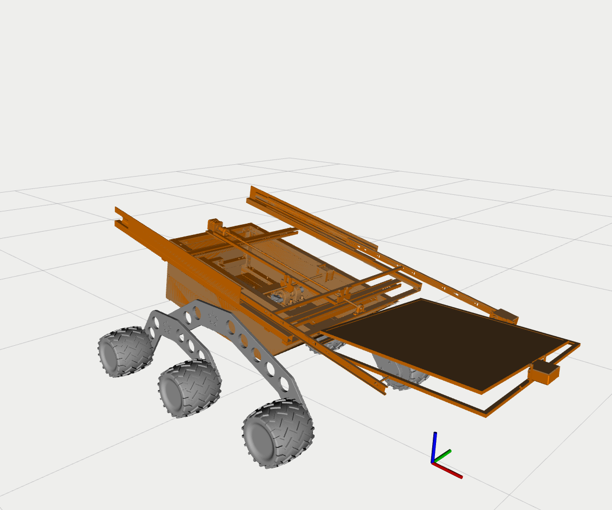

# Robot visualization

## RViz

If you want to `visualize` the **robot in `RViz`**, run the following command (no aditional installation needed):

```bash
  roslaunch sPrinter_description display.launch 
```
In **Displays** panel check the box for `TF`, all frames with connections will be displayed.

---

## Moveit 

### Prerequisities
- If you haven't yet, install moveit:
```bash
  sudo apt install ros-noetic-moveit
```

### Rviz visualization with MoveIt
In order to `visualize` the **robot in `RViz`** with `MoveIt` plugin, run the following command:

```bash
  roslaunch sprinter_robot_model demo.launch
```



- You can move robot to its poses by moving each joint separately or use **pre-defined poses** {home, work} in RViz \
  under 'MotionPlanning/Planning' to simplify the process. \
- To plan and execute simply push the button 'Plan & Execute'.\
  The **`MoveIt`** will plan the overall movement if it is reachable. \
  See the logs in your terminal if you are interested in processes which MoveIt undertakes when planning & executing.


### Robot model package
To `edit` the moveit package use command:
```bash
  roslaunch sprinter_robot_model setup_assistant.launch
```
In **Moveit Setup Assistant** edit/add configurations like robot poses, moveit planning groups and its links & joints, etc.
