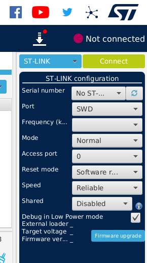
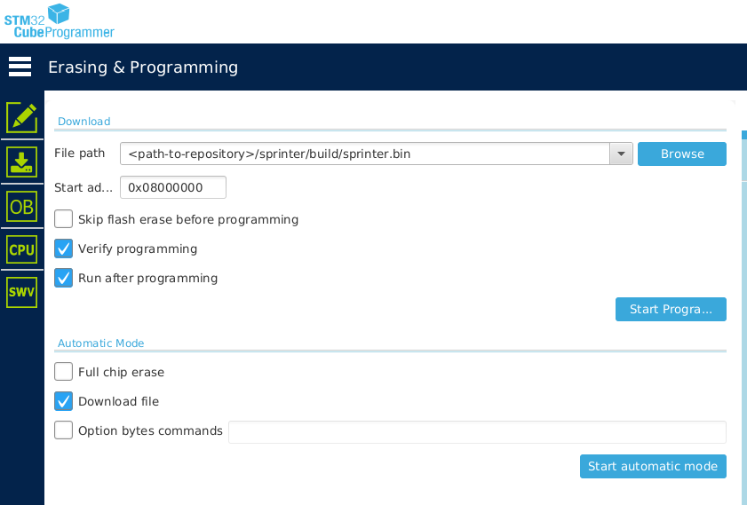

# sPrinter - Nucleo code development guidelines

1. Clone code
    
    ```
    $ git clone -b ohl-control https://github.com/xgallom/sprinter.git
    ```
2. Build code (Linux)
    ```
    $ sudo apt install gcc-arm-none-eabi
    $ cd <path-to-repository>/sprinter
    $ mkdir build
    $ cmake ..
    $ cmake --build
    ```

3. Download [STM32CubeProgrammer](https://www.st.com/en/development-tools/stm32cubeprog.html)

4. Connect to the Nucleo board with USB cable

5. Launch STM32CubeProgrammer and click **Connect**
<p align="center">
    
</p>

6. Download the code to the Nucleo board
    From the left-side menu select "Erasing & programming". Browse the path to the `sprinter.bin` file, then click **Start programming**
<p align="center">
    
</p>